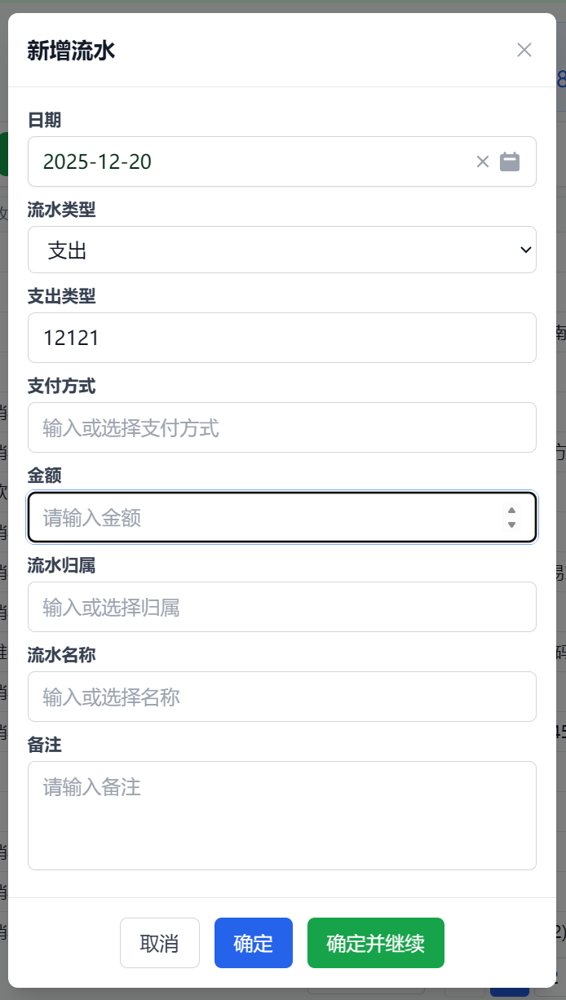
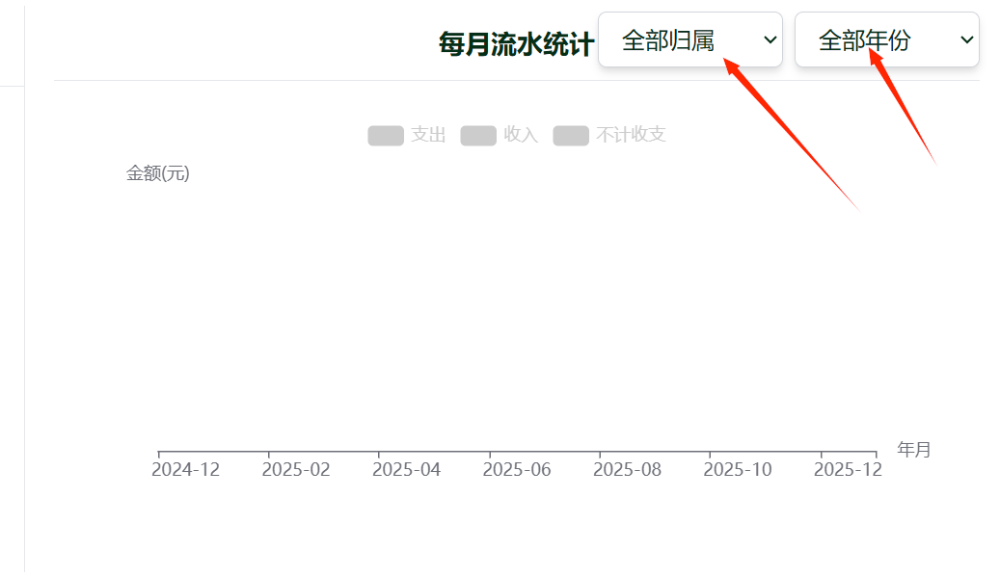
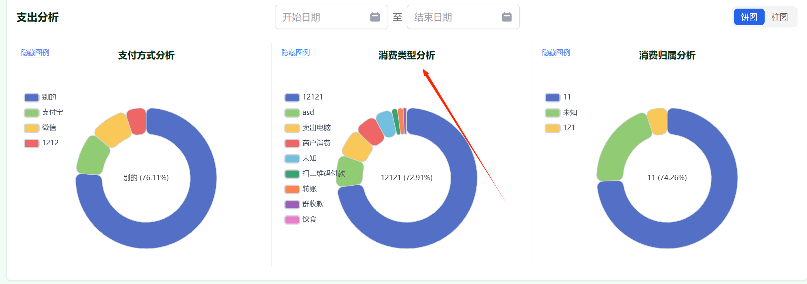
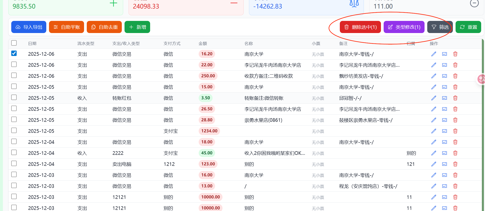

删减功能：
- 金额，不要0.01元这种精度的支持，全部改为整数元, **不需要**
- 消费类型分析（修改）
- 消费归属（不需要）
- 不需要待收款这一界面
- 完全不需要平账功能
- 可以隐藏，小票编辑
- ，必须填的内容需要显示指出，
- 数据分析 -> 每月流水统计： 
    - 建议解决方案，一次只能看4个月, 可以通过左右箭头翻页查看其他月份的数据
    - ，设计不美观，右上角
- 数据分析 -> 最主要的就是消费类型分析：
- 预算管理 ->
    - 删除刷新额度功能，自动刷新
    - 添加固定支出，(交互细节有问题，点两次保存出现问题)
- 流水管理 -> 
    - 多选情况，类型修改等暂时标灰色，多选之后启用
    - 排序功能

添加功能：
- 多条记录合并为单条记录
- 预算管理：
  - 预算超支提醒，（本月过去了50%，预算花费了70%，具体的提醒形式可以再商量）
- 消费类型，提供几种默认的分类，同时允许用户自定义；（现在有一次性多选的能力，需要进一步修改）
- 按照数额大小排序/类型排序
  